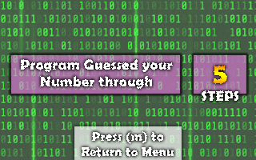

# Akinator in Assembly Language

# User Interface
We make this Game as easy as possible for user to Interract. This program takes 'wasd' key as an input. We make this program interactive by playing a sound when user press an input, and also make the selection change it's color, so user will know which menu is being selected.
## Main Menu

## Game Mode

## Program Success

# What's This Game About ?

# Credits
This contains some of the people and art that contributes to this program. Without them this project will not be completed. 
## Developer
### Muhammad Irfan Fakrianto
- NPM : 1806200356
- Almamater : Universitas Indonesia
### Mohammad Salman Alfarisi
- NPM : 1806200381
- Almamater : Universitas Indonesia
### Ramadhan Kalih Sewu
- NPM : 1806148826
- Almamater : Universitas Indonesia
### Qisas Tazkia Hasanudin
- NPM : 1806200210
- Almamater : Universitas Indonesia
